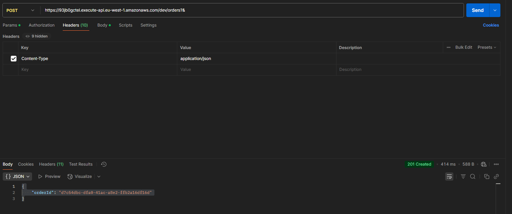
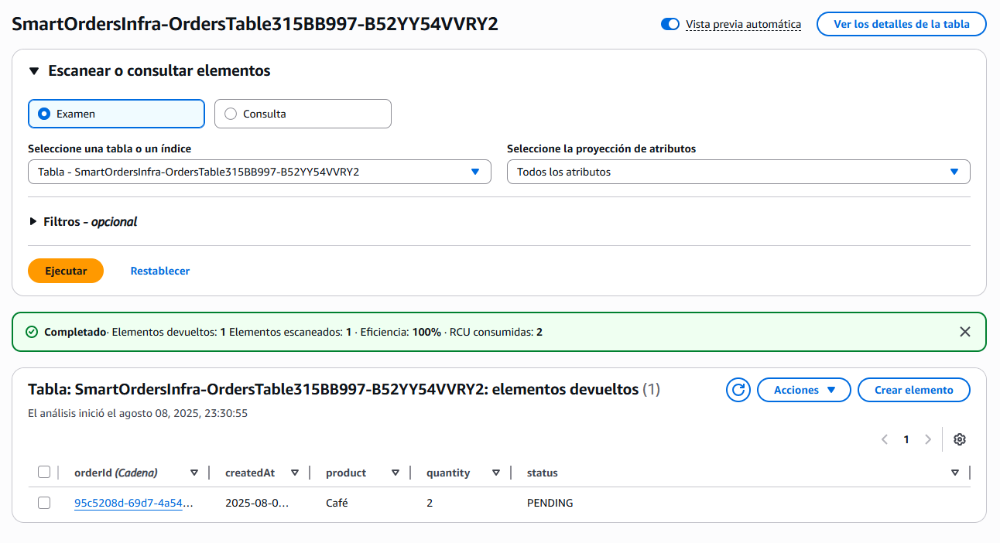
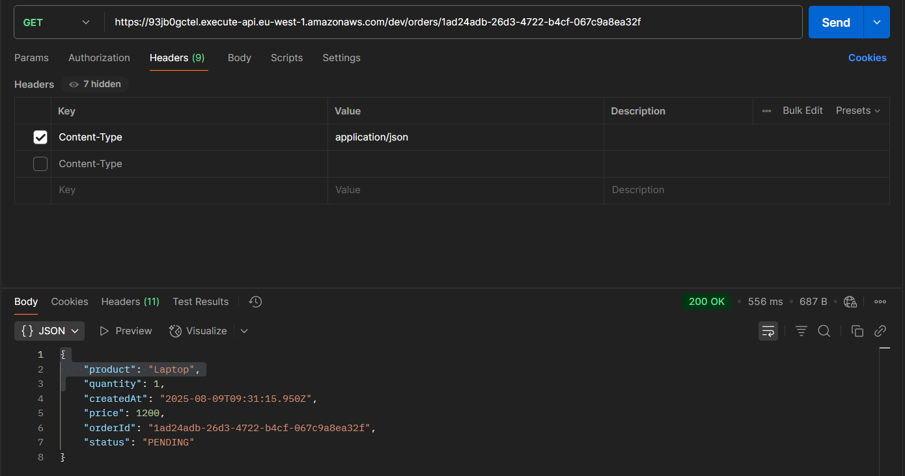
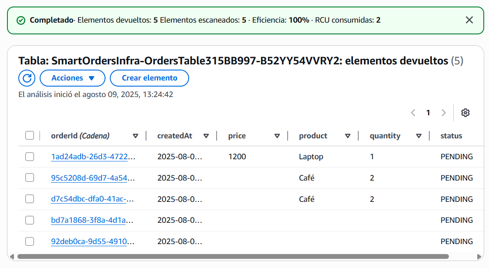

# Memoria del proyecto (v0)

> Consejo: escribe aquí cada paso breve en Markdown (fechas, capturas, decisiones).  
> Al final, exporta a PDF para entregar o adjuntar en LinkedIn.

## Resumen
## Objetivos
## Arquitectura
## Implementación por fases

## Hito 1 — POST /orders funcional
**Fecha:** 08/08/2025

- **Objetivo:** implementar endpoint para crear pedidos y almacenarlos en DynamoDB.
- **Servicios AWS usados:** API Gateway (REST), Lambda, DynamoDB.
- **Resultado:** petición POST crea un pedido, devuelve `orderId` y persiste los datos.
- **Pruebas:**
  - 
  - 
- **Próximos pasos:** implementar GET /orders/{id}, validaciones y CORS.

## Hito 2 — GET /orders/{id} funcional
**Fecha:** 09/08/2025

- **Objetivo:** permitir consultar un pedido específico por su ID.
- **Servicios AWS usados:** API Gateway (REST), Lambda, DynamoDB.
- **Resultado:** petición GET devuelve el pedido en JSON.
- **Pruebas:**
  - 
  - 
- **Próximos pasos:** implementar GET /orders (listado) y validaciones de entrada.

## Pruebas
## Costes
## Lecciones aprendidas

