# Memoria del proyecto (v0)

> Consejo: escribe aquí cada paso breve en Markdown (fechas, capturas, decisiones).  
> Al final, exporta a PDF para entregar o adjuntar en LinkedIn.

## Resumen
## Objetivos
## Arquitectura
## Implementación por fases

## Hito 1 — POST /orders funcional
**Fecha:** 08/08/2025

- **Objetivo:** implementar endpoint para crear pedidos y almacenarlos en DynamoDB.
- **Servicios AWS usados:** API Gateway (REST), Lambda, DynamoDB.
- **Resultado:** petición POST crea un pedido, devuelve `orderId` y persiste los datos.
- **Pruebas:**
- 
  - 
  - 
- **Próximos pasos:** implementar GET /orders/{id}, validaciones y CORS.

## Hito 2 — GET /orders/{id} funcional
**Fecha:** 09/08/2025

- **Objetivo:** permitir consultar un pedido específico por su ID.
- **Servicios AWS usados:** API Gateway (REST), Lambda, DynamoDB.
- **Resultado:** petición GET devuelve el pedido en JSON.
- **Pruebas:**
- 
  - 
  - 
- **Próximos pasos:** implementar GET /orders (listado) y validaciones de entrada.

- ## Hito 3 — GET /orders (listar pedidos) funcional
**Fecha:** 09/08/2025

- **Objetivo:** implementar un endpoint que devuelva todos los pedidos almacenados en DynamoDB.
- **Servicios AWS usados:** API Gateway (REST), Lambda, DynamoDB.
- **Resultado:** petición GET a `/orders` devuelve un array JSON con todos los pedidos de la tabla.
- **Pruebas:**
- 
  - 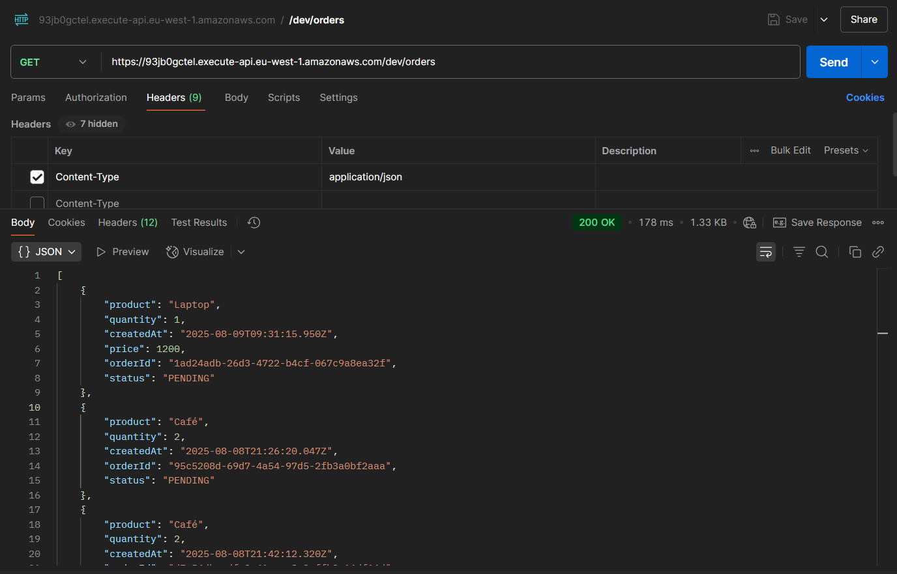
  - 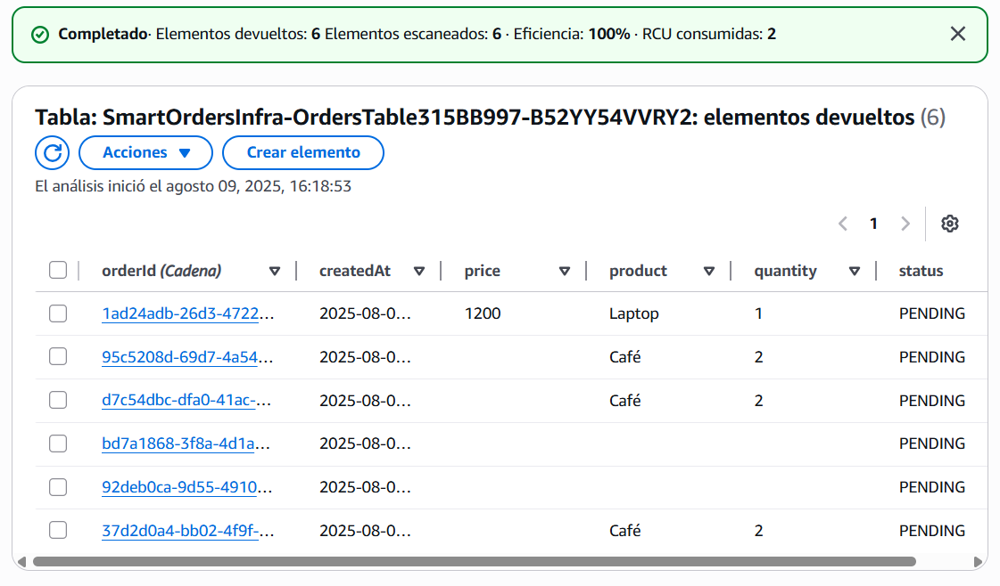
- **Próximos pasos:** implementar filtros, paginación y validaciones de datos.

- ## Hito 4 — PUT /orders/{id} funcional
**Fecha:** 09/08/2025

- **Objetivo:** Permitir actualizar campos de un pedido existente (status, quantity, product, price) en DynamoDB.
- **Servicios AWS usados:** API Gateway (REST), Lambda, DynamoDB, IAM.
- **Resultado:** El endpoint recibe un `orderId` en la ruta y un body JSON con los campos a modificar. Si el pedido existe, se actualiza y devuelve el nuevo estado. 
- **Validaciones implementadas:**
  - `quantity` debe ser positivo.
  - `status` solo puede ser uno de `PENDING`, `PROCESSING`, `SHIPPED`, `CANCELLED`, `COMPLETED`.
  - Solo se actualizan campos permitidos.
- **Errores manejados:**
  - `400` si faltan parámetros o el body es inválido.
  - `404` si el pedido no existe.
  - `500` para errores internos.
- **Pruebas:**
- 
  - 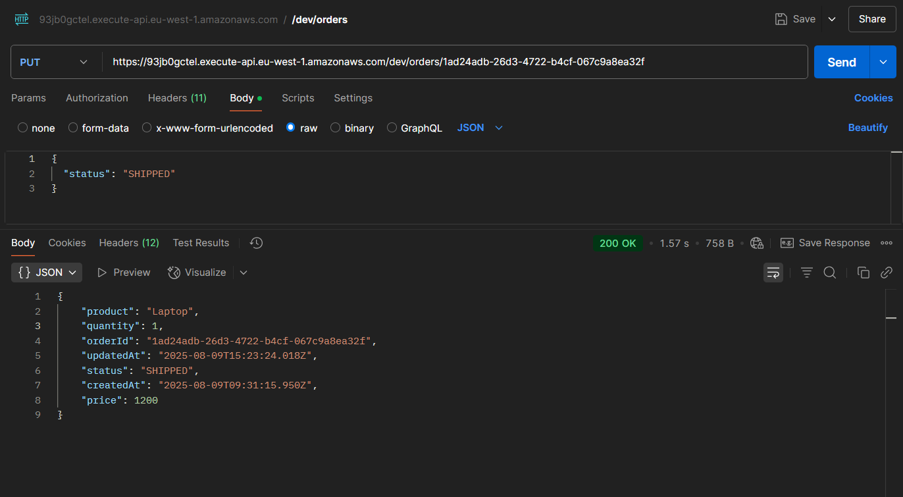
  - 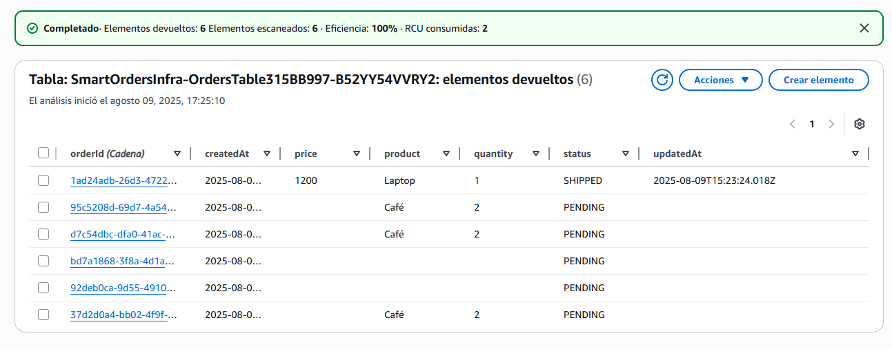
- **Próximos pasos:** Implementar DELETE /orders/{id}.

## Hito 5 — DELETE /orders/{id} funcional
**Fecha:** 09/08/2025

- **Objetivo:** permitir eliminar un pedido por `orderId` desde DynamoDB.
- **Servicios AWS usados:** API Gateway (REST), Lambda, DynamoDB, IAM.
- **Resultado:** `DELETE /orders/{id}` elimina el ítem si existe y devuelve `204 No Content`. Si no existe, devuelve `404 Not Found`.
- **Seguridad/Permisos:** rol de ejecución con `dynamodb:DeleteItem` sobre la tabla.
- **Pruebas:**
- 
  - 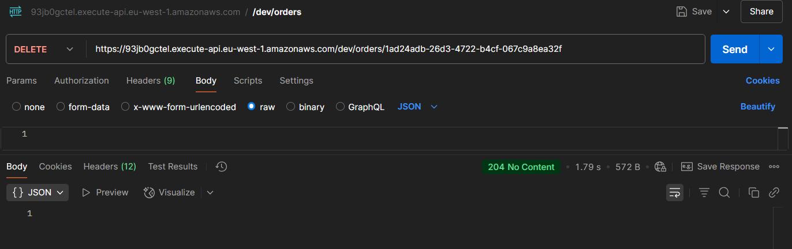
  - 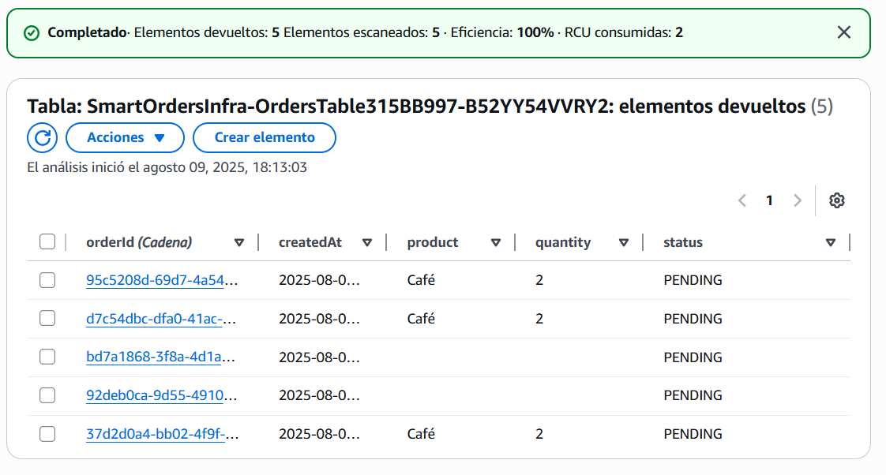
- **Próximos pasos:** creación de base de datos relacionl RDS.


## Hito 6 — RDS para datos relacionales (catálogo de productos) y relación con DynamoDB
**Fecha:** 11/08/2025

- **Objetivo:** integrar una base de datos relacional Amazon RDS (MySQL) para almacenar información de productos y enriquecer los pedidos existentes en DynamoDB.

- **Servicios AWS usados:** API Gateway (REST), Lambda, DynamoDB, Amazon RDS (MySQL), IAM.

- **Resultado:** el endpoint GET /orders/{id}/with-product consulta primero DynamoDB para obtener el pedido y luego RDS para añadir información del producto (precio, descripción, etc.). Si no se encuentra el producto, el campo productInfo es null.

- **Pruebas:**
-
  - 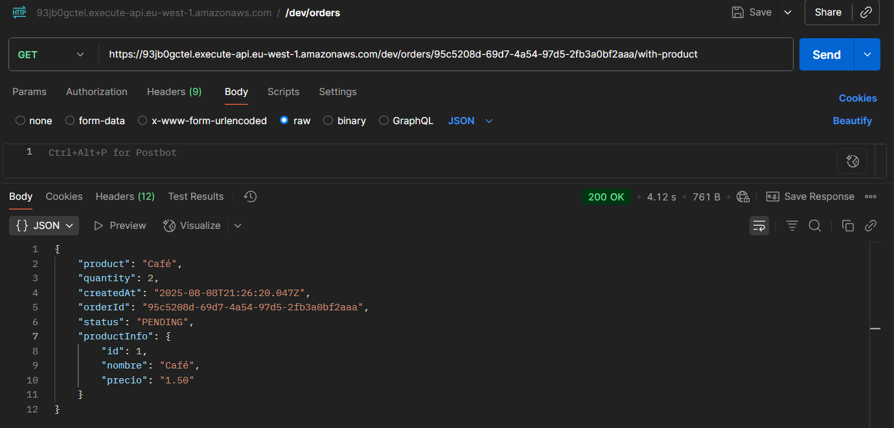
  - 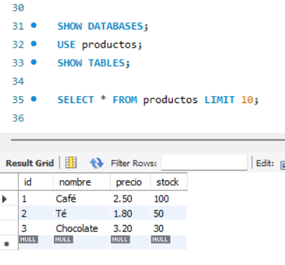

- **Próximos pasos:** AWS Step Functions.

- ---

## Hito 7 — Step Functions: flujo “procesar pedido”
**Fecha:** 12/08/2025  

**Objetivo:**  
Implementar un flujo orquestado con **AWS Step Functions** para procesar pedidos:  
1. Validar stock  
2. Cobrar pago  
3. Notificar al cliente  

**Servicios AWS usados:**  
- AWS Step Functions (State Machine)  
- AWS Lambda (ValidateStock, ChargePayment, ReleaseStock, NotifyCustomer)  
- IAM (Roles y permisos)  

**Resultado:**  
Se implementó y desplegó el flujo usando AWS SAM.  
- Ejecución exitosa devuelve `reservationId`, `paymentId` y flag `notified: true`.  
- Errores controlados:  
  - **StockNoDisponible** → flujo falla antes de cobrar.  
  - **Payment.Fallo** → se activa la tarea de compensación `ReleaseStock`.

**Despliegue:**  
```bash
sam build
sam deploy --guided
````


## Hito 8 — SQS/EventBridge para colas de pedidos a procesar
**Fecha:** 21/08/2025

- **Objetivo:**  
  Implementar una cola FIFO en **Amazon SQS** para recibir los pedidos creados desde la API y disparar automáticamente el flujo de Step Functions (`procesar-pedido-hito7`) mediante un **Worker Lambda**.

- **Servicios AWS usados:**  
  * Amazon SQS (cola principal + DLQ)  
  * AWS Lambda (OrdersWorkerFunction)  
  * AWS Step Functions (flujo de orquestación)  
  * IAM (roles y permisos generados por SAM)

- **Resultado:**  
  Cada vez que se hace un `POST /orders`:
  1. La API envía el mensaje a la cola **`smart-orders-orders-to-process.fifo`**.  
  2. El Worker Lambda (`smart-orders-orders-worker`) consume el mensaje y lanza la ejecución de la Step Function `procesar-pedido-hito7`.  
  3. La cola se queda vacía (los mensajes no quedan pendientes en SQS).  

- **Pruebas:**  
  - Creación de pedido desde Postman → pedido en estado **CREATED**  
    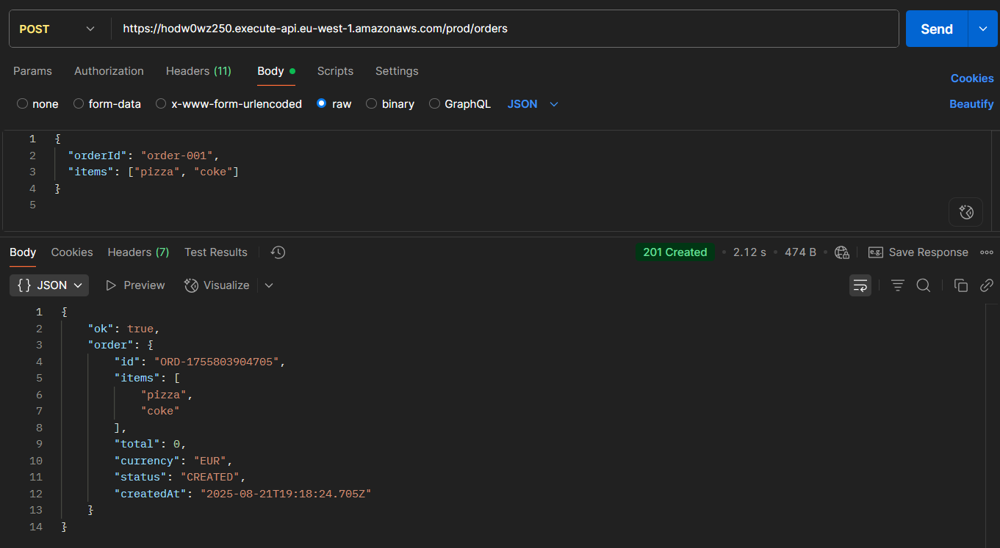  
  - Ejecución iniciada en Step Functions  
    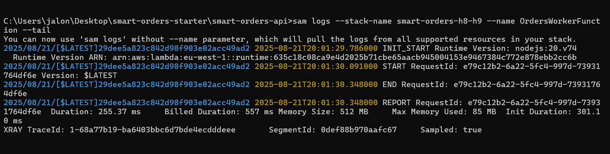  

- **Próximos pasos:**  
  Conectar la **SNS** para enviar notificaciones de estado (Hito 9).


## Hito 9 — SNS para notificar cambios de estado
**Fecha:** 25/08/2025  

### Objetivo
Notificar al cliente (por email/SMS) cuando el estado de su pedido cambie.

---

### Implementación
- Creación de la Lambda `smart-orders-status-notifier` (`src/notifier/status.js`).
- Configuración del Tópico SNS `smart-orders-status`.
- Conexión de la Step Function al notificador (`NotifyStatus`).
- Suscripción confirmada por email (Gmail).

---

### Pruebas
- Cambio de estado en la Step Function → invoca la Lambda notificador  
  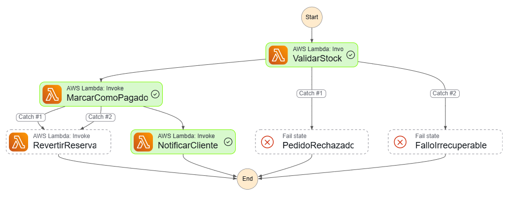  

- Mensaje publicado en el Tópico SNS (`NumberOfMessagesPublished` en CloudWatch incrementa)  
  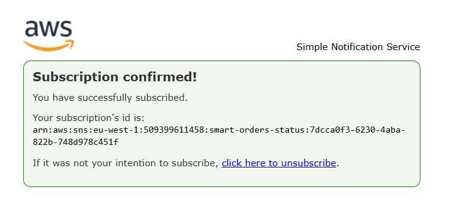  

- Email recibido en Gmail con el estado actualizado del pedido  
  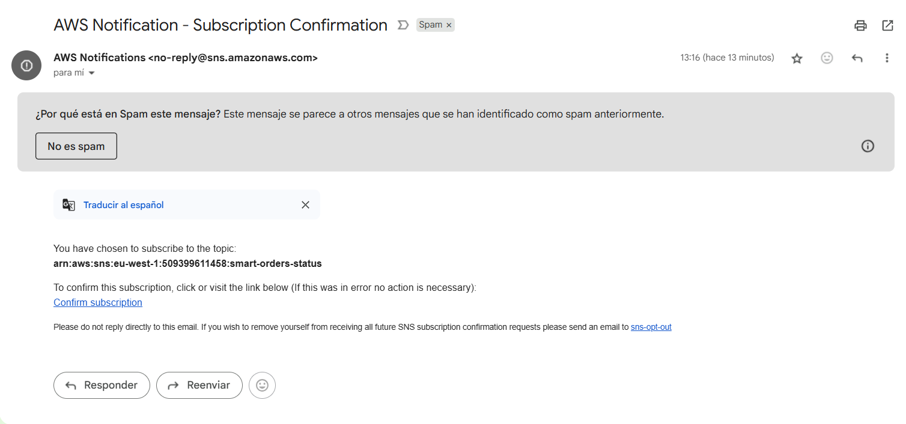  

- Alarma de CloudWatch configurada sobre `NumberOfNotificationsFailed`  
  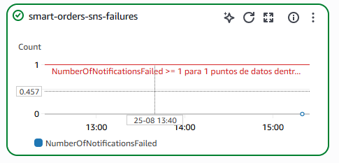  

---

### Resultado
- Los pedidos generan notificaciones automáticas al cambiar de estado.
- Los clientes reciben emails confirmando el estado (`CREATED`, `PAID`, `SHIPPED`, etc.).
- Se garantiza observabilidad y alertas ante fallos con CloudWatch.


## Hito 11 — WAF en API Gateway para filtrar ataques comunes
**Fecha:** 27/08/2025  

### Objetivo
Proteger la API Smart Orders contra ataques comunes en capa 7 (SQLi, XSS, IP maliciosas, floods) antes de que lleguen a Lambda.

---

### Implementación
- Creación del **Web ACL** `smartorders-waf` en AWS WAF (scope **Regional**).
- Asociación del Web ACL al **stage `dev`** de la API Gateway (`93jb0gctel`).
- Añadidas reglas gestionadas de AWS (gratuitas):
  - `Core rule set` (protección OWASP genérica).
  - `Known bad inputs` (bloqueo de patrones maliciosos conocidos).
  - `SQL database` (detección de inyección SQL).
  - `Amazon IP reputation list` (bloqueo de IPs sospechosas).
  - `Anonymous IP list` (VPN, proxies, Tor).
- Acción configurada en **Block** (no solo *Count*).
- Default action del Web ACL: **Allow**.

---

### Pruebas
- **Reglas del Web ACL configuradas en AWS WAF**   
  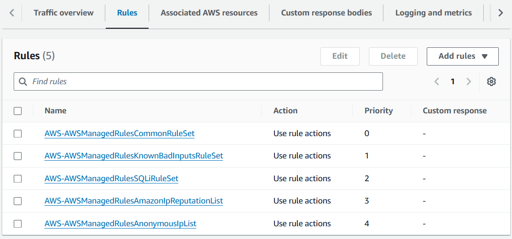

- **Prueba SQLi bloqueada por WAF (403 Forbidden)**  
  

- **Inyección SQL** en querystring → **403 Forbidden** bloqueado por WAF  
  ```bash
  curl --ssl-no-revoke -i "https://93jb0gctel.execute-api.eu-west-1.amazonaws.com/dev/orders?search=%27%20OR%201%3D1%20--"


## Hito 12 — Secrets Manager para gestionar credenciales seguras  
**Fecha:** 28/08/2025  

### Objetivo
Centralizar y proteger las credenciales de acceso a la base de datos en **AWS Secrets Manager**, evitando exponer contraseñas en el código o en variables de entorno planas.

---

### Implementación
- Creación del secreto en **AWS Secrets Manager** con los datos de conexión al RDS:
  ```json
  {
    "host": "xxxxx.eu-west-1.rds.amazonaws.com",
    "port": 3306,
    "username": "db_user",
    "password": "********",
    "engine": "mysql"
  }


## Pruebas
## Costes
## Lecciones aprendidas

